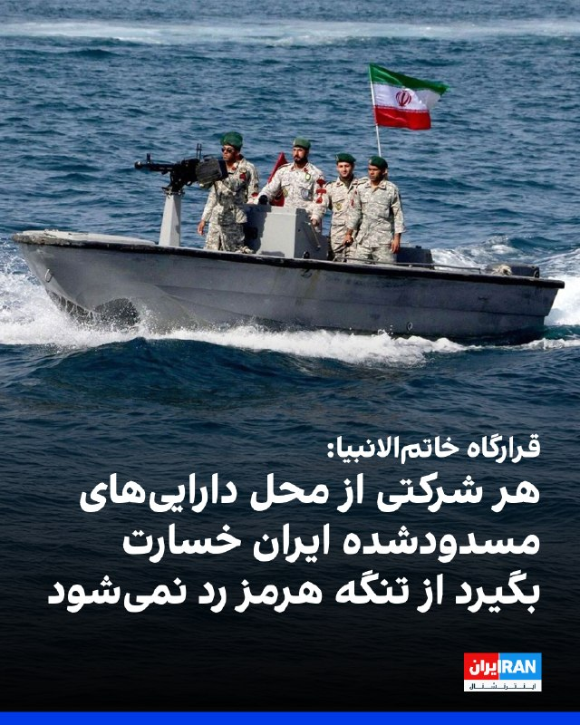
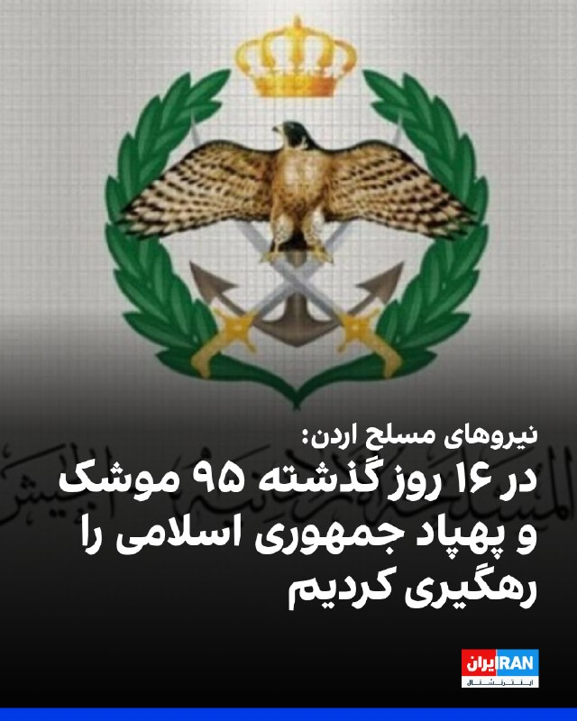
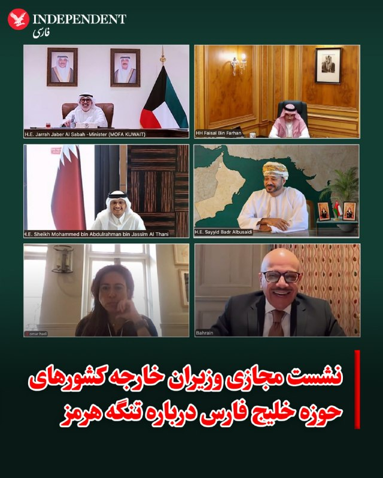
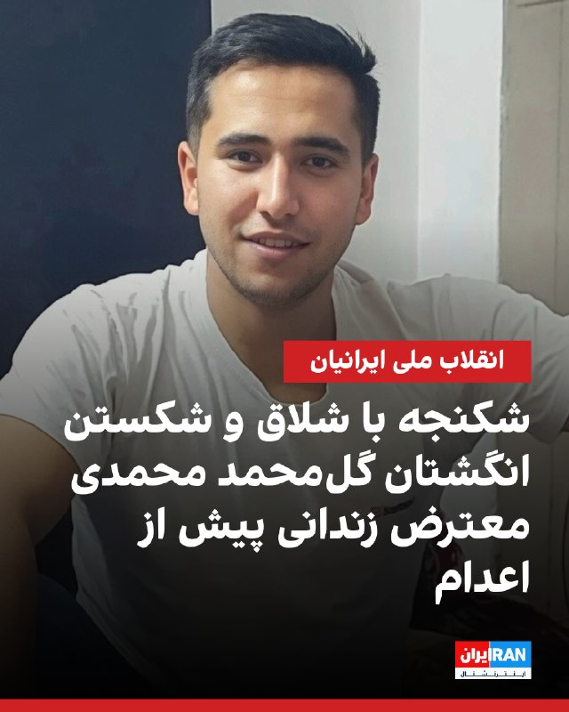
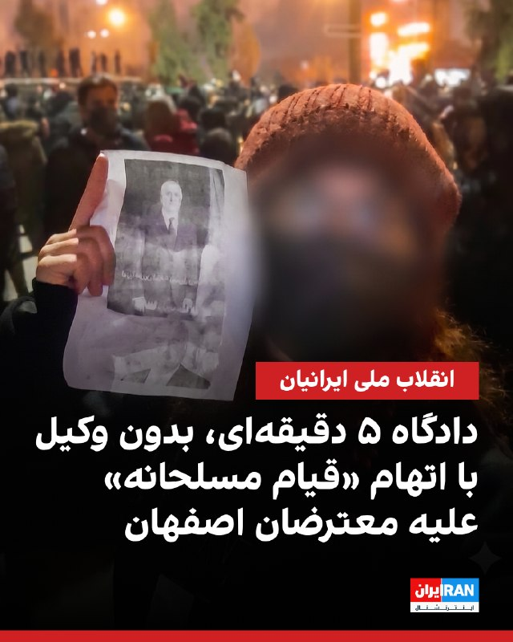
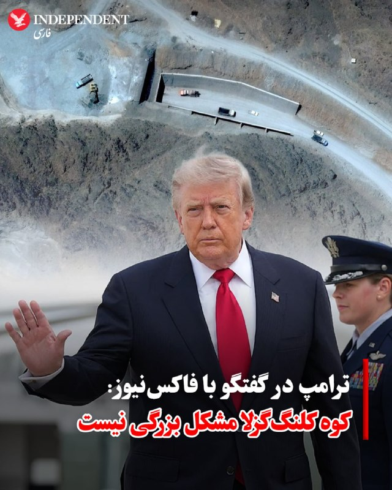
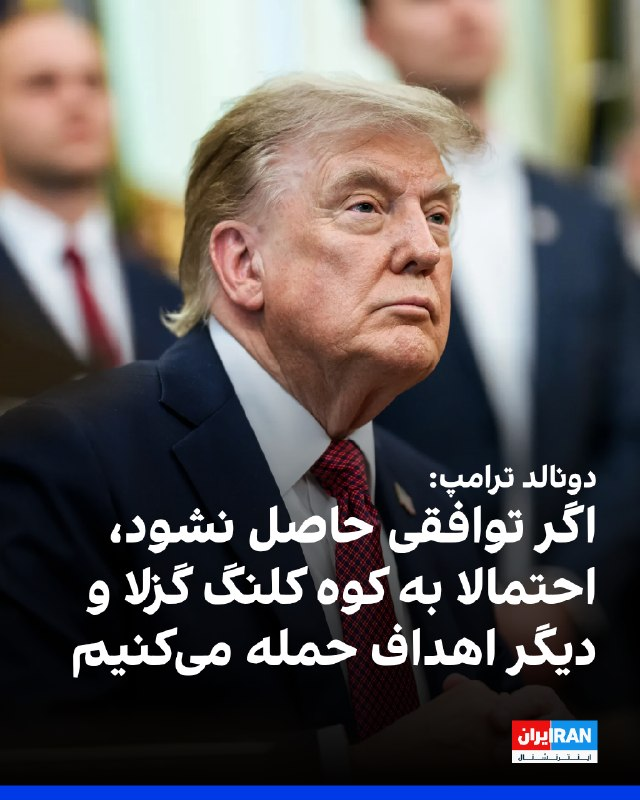
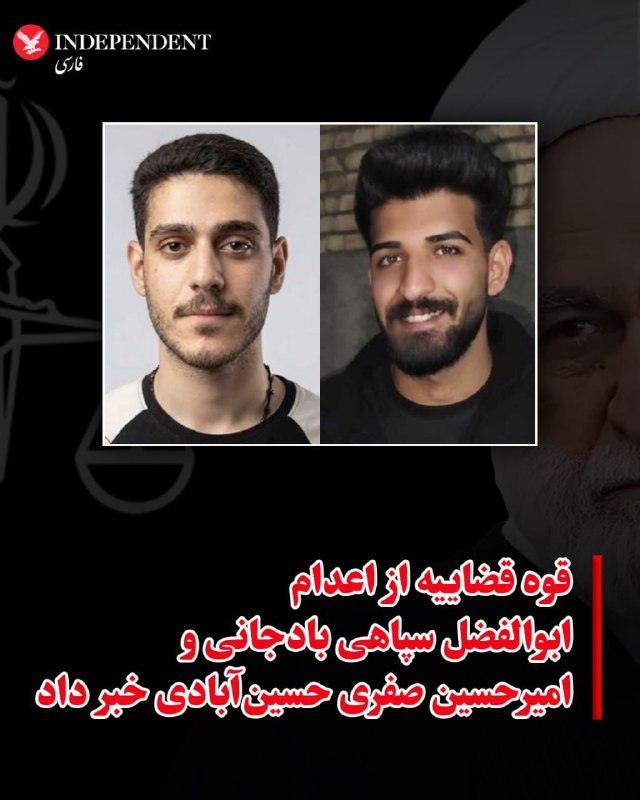

# خواننده تلگرام

<!-- TOP_NAV START -->

<!-- TOP_NAV END -->

<!-- MSG START -->

---
📅 بروزرسانی: 1405/05/06 17:20
---

## VahidOOnLine — post 252522

♦️دونالد ترامپ، رئیس‌جمهوری آمریکا، در گفت‌وگوی تلفنی با شبکه فاکس‌نیوز اعلام کرد در دست نیافتن به توافق با ایران، واشنگتن می‌تواند به‌سرعت زیرساخت‌های حیاتی این کشور را هدف قرار دهد.
او با اشاره به اختلاف‌نظرها در داخل آمریکا گفت برخی خواهان تشدید حملات و «نابودی کامل» ایران هستند، در حالی که گروهی دیگر معتقدند اکنون زمان مناسبی برای رسیدن به توافق است.
ترامپ گفت هدف قرار دادن پل‌ها و نیروگاه‌های ایران برای آمریکا «بسیار ساده» است و افزود: «می‌توانم در کمتر از یک ساعت بیشتر پل‌ها را از بین ببرم یا در یک روز همه نیروگاه‌ها را از کار بیندازم.»
او همچنین گفت این موضوعات را در جریان مذاکرات به طرف ایرانی منتقل کرده و تأکید کرد در صورت شکست گفتگوها، ایران با خسارات گسترده‌ای روبه‌رو خواهد شد.
ترامپ در عین حال هشدار داد چنین اقداماتی می‌تواند پیامدهای انسانی گسترده‌ای داشته باشد و میلیون‌ها نفر را بدون برق و زیرساخت‌های حیاتی باقی بگذارد.
‌🇸🇦 Indypersian

🤖 @VahidOOnLine

## VahidOOnLine — post 252521

  

سخنگوی قرارگاه مرکزی خاتم‌الانبیا با انتشار ویدیویی و با اشاره به سخنان دونالد ترامپ، رییس‌جمهوری آمریکا، مبنی بر اینکه خسارت شناورهایی که در تنگه هرمز آسیب دیدند، از محل دارایی‌های بلوکه‌شده ایران پرداخت خواهد شد، واکنش نشان داد.

او گفت این شناورها به دلیل «تخلف در عبور از مسیر غیرقانونی و ناامن جنوب تنگه هرمز» آسیب دیدند.

سخنگوی قرارگاه مرکزی خاتم‌الانبیا با هشدار به دونالد ترامپ درباره تبعات این «اقدام غیرقانونی» گفت: «به همه شرکت‌ها و کشورهایی که از پیشنهاد ترامپ استقبال کنند و از دارایی‌های بلوکه‌شده ایران تحت این عنوان استفاده کنند، اعلام می‌کنیم از این پس نیروهای جمهوری اسلامی اجازه تردد هیچ‌یک از شناورهای آن‌ها را از تنگه هرمز نخواهند داد.»
‌🏁 🇬🇧 IranintlTV

🤖 @VahidOOnLine

## VahidOOnLine — post 252520

ویدیوی رسیده به ایران‌اینترنشنال نشان می‌دهد تعدادی از شهروندان تهران سه‌شنبه ششم مرداد پس از اعدام‌ بازداشتی‌های دی‌ماه در اصفهان، از درون خانه‌ها علیه خامنه‌ای و جمهوری اسلامی شعار سردادند.
‌🏁 🇬🇧 IranintlTV

🤖 @VahidOOnLine

## VahidOOnLine — post 252519

  <a href="telegram/content/VahidOOnLine_252519_1785246643.mp4" target="_blank">🎬 Download video</a>

♦️ویدیوهای منتشرشده، روز سه‌شنبه ششم مرداد، تجمع اعتراضی
شهروندان در اصفهان را نشان می‌دهد که حاضران در آن شعار «بی‌شرف، بی‌شرف» سر می‌دهند. این تجمع پس از اجرای حکم اعدام ابوالفضل سپاهی‌بادجانی و امیرحسین صفری حسین‌آبادی، دو نفر از محکومان پرونده موسوم به «میدان علیخانی»، برگزار شد.
با اجرای این دو حکم در بامداد سه‌شنبه، تعداد اعدام‌شدگان این پرونده به چهار نفر رسید. هشت متهم دیگر این پرونده، شامل ابوالفضل ابراهیمی، امیرحسین ابراهیمی‌انالوچه، شروین باقریان جبلی، قائم حسینی، علی دشتی، علیرضا رئیسی، علیرضا سپاهی و امیرحسین ملکی، همچنان با خطر اجرای حکم اعدام روبه‌رو هستند.
بر اساس گزارش‌ها، از شامگاه دوشنبه و همزمان با انتشار خبر احتمال اجرای علنی احکام اعدام در میدان علیخانی، تعدادی از شهروندان برای اعتراض و تلاش به منظور جلوگیری از اجرای احکام در اطراف این میدان تجمع کردند. هرچند در نهایت نشانه‌ای از اجرای حکم در ملاءعام مشاهده نشد، گزارش‌ها حاکی از آن است که نیروهای امنیتی با معترضان درگیر شدند و تعدادی از آنان را بازداشت کردند.
‌🇸🇦 Indypersian

🤖 @VahidOOnLine

## VahidOOnLine — post 252518

  

خبرگزاری رسمی اردن، بترا، روز سه‌شنبه گزارش داد نیروهای مسلح این کشور در ۱۶ روز گذشته، ۷۰ موشک بالستیک و ۲۵ پهپاد جمهوری اسلامی را رهگیری و منهدم کرده‌اند. به گفته این خبرگزاری، این حملات هیچ تلفات انسانی یا خسارت مادی در اردن بر جای نگذاشته است.

نیروهای مسلح اردن اعلام کردند در همین بازه زمانی، سه بالن هدایت‌شونده حامل مواد مخدر، سه پهپاد حامل مواد مخدر و پنج متجاوز مرزی را متوقف کرده‌اند و در مجموع از ۱۱ تهدید دیگر در مرزهای شمالی، شرقی و جنوبی این کشور جلوگیری شده است.
‌🏁 🇬🇧 IranintlTV

🤖 @VahidOOnLine

## VahidOOnLine — post 252516

  

♦️ وزیران امور خارجه کشورهای عضو شورای همکاری خلیج فارس (GCC) طی یک نشست مجازی، مذاکرات جاری میان ایالات متحده و جمهوری اسلامی ایران را مورد بحث و بررسی قرار دادند.

وزارت امور خارجه عمان با انتشار بیانیه‌ای اعلام کرد در این گفتگوها بر «اهمیت تشدید هماهنگی‌ها جهت تضمین آزادی و امنیت دریانوردی در تنگه هرمز و اولویت دادن به راهکارهای سیاسی و دیپلماتیک که امنیت و ثبات منطقه را ارتقا می‌بخشد»، تاکید شده است.
‌🇸🇦 Indypersian

🤖 @VahidOOnLine

## VahidOOnLine — post 252515

  

یک منبع آگاه به ایران‌اینترنشنال گفت گل‌محمد محمدی، زندانی اعدام‌شده، در دوران بازداشت تحت شکنجه‌های شدید جسمی قرار گرفته بود.

بر اساس اطلاعاتی که در اختیار ایران‌اینترنشنال قرار گرفته، ماموران در همان روز نخست بازداشت، دو انگشت گل‌محمد محمدی را شکستند. به گفته این منبع، او در طول ماه نخست بازداشت نیز به‌طور مستمر شکنجه می‌شد و ماموران هر روز چند بار، او را با شلاق می‌زدند.

این منبع افزود که در ماه‌های پس از بازداشت، بستگان گل‌محمد محمدی برای انتخاب وکیل مستقل با موانع امنیتی و قضایی روبه‌رو بودند و در پیگیری وضعیت او نیز از سوی نهادهای امنیتی به بازداشت تهدید شدند.

به گفته این منبع، مقام‌های جمهوری اسلامی پس از اجرای حکم، پیکر گل‌محمد محمدی را بدون برگزاری مراسم عمومی در روستای رحمت‌آباد، از توابع شهرستان تیران و کرون در استان اصفهان، به خاک سپردند.

گل‌محمد محمدی، ۲۳ ساله و تبعه افغانستان، و عرفان اسفندیاری، دو تن از معترضان بازداشت‌شده در جریان انقلاب ملی، بامداد ۲۸ تیرماه در اصفهان اعدام شدند.
‌🏁 🇬🇧 IranintlTV

🤖 @VahidOOnLine

## VahidOOnLine — post 252514

  

همزمان با تداوم اعدام‌ها در اصفهان، گزارش‌های رسیده از دادگاه‌های انقلاب حاکی از محاکمه شتاب‌زده و بدون تشریفات قانونی معترضان است؛ به‌گونه‌ای که در یک نمونه، دادگاه یک جوان زندانی تنها پنج دقیقه به طول انجامیده و متهمان با اتهامات سنگینی از جمله «قیام مسلحانه در برابر حکومت اسلامی» روبه‌رو شده‌اند.

منابع مطلع تایید کرده‌اند که در این روند دادرسی، دستگاه قضایی حق دسترسی به وکیل را از بازداشت‌شدگان سلب کرده و خانواده‌ها نیز از تماس و ملاقات کافی با زندانیان خود محرومند. در کیفرخواست‌های صادرشده، علاوه بر اتهام قیام مسلحانه که احتمال صدور حکم اعدام را به شدت افزایش می‌دهد، عناوین دیگری نظیر «اغوا یا تحریک مردم به کشتار»، «اجتماع و تبانی علیه امنیت»، «تبلیغ علیه نظام» و «توهین به مقدسات» نیز علیه شهروندان معترض مطرح شده است.
روز سه‌شنبه دو تن از معترضان پرونده موسوم به «میدان علیخانی» در خیابان‌های اصفهان اعدام شدند. همزمان، فراخوانده شدن شماری دیگر از متهمان این پرونده برای ملاقات آخر با خانواده‌ها، نگرانی‌ها را نسبت به اجرای احکام افزایش داده است.
‌🏁 🇬🇧 IranintlTV

🤖 @VahidOOnLine

## VahidOOnLine — post 252513

  

♦️ دونالد ترامپ، رئیس‌جمهوری آمریکا، بار دیگر تهدید کرد در صورتی که توافقی حاصل نشود، «کوه کلنگ‌گزلا» (تاسیسات زیرزمینی هسته‌ای که در عمق کوه قرار دارند) در ایران و همچنین پل‌ها و سایر اهداف غیرنظامی می‌توانند هدف قرار گیرند.

او روز سه‌شنبه ششم مرداد، در گفتگو با شبکه «فاکس نیوز» با اشاره به اینکه «گفتگوهای خوبی» انجام شده است، گفت: «کوه کلنگ‌گزلا مشکل بزرگی نیست. ما الان موضع بسیار قدرتمندی در قبال ایران داریم.»

با این حال، ترامپ افزود که ترجیح می‌دهد از حمله به نیروگاه‌های برق و پل‌های ایران خودداری کند و تصریح کرد: «من به دنبال انجام این کار نیستم.»
‌🇸🇦 Indypersian

🤖 @VahidOOnLine

## VahidOOnLine — post 252512

♦️زمین‌لرزه‌ای قدرتمند به بزرگی ۷.۱ روز سه‌شنبه جنوب‌غرب ژاپن را لرزاند و باعث ایجاد خساراتی از جمله تخریب ساختمان‌ها و وقوع آتش‌سوزی در برخی مناطق شد.
بر اساس تصاویر منتشرشده در شبکه‌های اجتماعی، قفسه‌های فروشگاه‌ها در شهر کورومه لرزیده و اجناس به زمین ریخته‌اند. گزارش‌ها همچنین از انتقال دست‌کم ۵۰ نفر به بیمارستان خبر می‌دهد.
سازمان هواشناسی ژاپن اعلام کرد این زمین‌لرزه ساعت ۴:۲۷ بعد از ظهر به وقت محلی در جزیره کیوشو رخ داده و لرزش آن در مناطق اطراف از جمله جزیره شیندو نیز احساس شده است.
این سازمان با صدور هشدار سونامی اعلام کرد احتمال شکل‌گیری امواجی با ارتفاع بیش از یک متر در مناطق ساحلی وجود دارد.
در همین حال، مقام‌های ژاپنی اعلام کردند تاکنون مورد غیرعادی در تاسیسات هسته‌ای این کشور گزارش نشده است.
‌🇸🇦 Indypersian

🤖 @VahidOOnLine

## VahidOOnLine — post 252511

  

دونالد ترامپ، رییس‌جمهوری آمریکا، در گفت‌وگو با شبکه فاکس‌نیوز بار دیگر جمهوری اسلامی را تهدید کرد و گفت اگر توافقی میان دو طرف حاصل نشود، ممکن است کوه «کلنگ‌ گزلا» و همچنین دیگر اهداف را در ایران هدف قرار گیرند. او در عین حال گفت مذاکرات با جمهوری اسلامی «خوب» بوده است.

ترامپ افزود ترجیح می‌دهد از حمله به نیروگاه‌ها و پل‌های ایران خودداری کند، اما تاکید کرد واشینگتن اکنون در برابر تهران در «موضعی بسیار قدرتمند» قرار دارد.

او در پاسخ به این پرسش که آیا قصد دارد زیرساخت‌هایی مانند نیروگاه‌ها و پل‌های ایران را هدف قرار دهد، گفت: «مایلم از حمله به نیروگاه‌ها و پل‌ها خودداری کنم.» ترامپ همچنین افزود: «به دنبال انجام چنین کاری نیستم.»

رییس‌جمهوری آمریکا همچنین گفت تاسیسات هسته‌ای کوه کلنگ گزلا «مشکل بزرگی نیست» و افزود: «دیگر نمی‌توانیم اجازه دهیم ایران توافق‌ها را نقض کند.»
‌🏁 🇬🇧 IranintlTV

🤖 @VahidOOnLine

## VahidOOnLine — post 252510

  <a href="telegram/content/VahidOOnLine_252510_1785246652.mp4" target="_blank">🎬 Download video</a>

بر اساس ویدیو و پیام فرستاده‌شده برای گزارشگر من‌وتو، یک فرد در یک خیابان یک‌طرفه برخلاف جهت مسیر حرکت کرده و پس از مواجهه با یک راننده زن به‌دلیل نداشتن حجاب اجباری، به خودروی او ضربه می‌زند.
‌🏁 🇬🇧 ManotoTV

🤖 @VahidOOnLine

## VahidOOnLine — post 252501

  <a href="telegram/content/VahidOOnLine_252501_1785246655.mp4" target="_blank">🎬 Download video</a>

اعدام ابوالفضل سپاهی و امیرحسین صفری در میدان علیخانی اصفهان، تلاشی بود از سوی حکومت برای نمایش قدرت با پیامی هم‌زمان برای مخالفان و حامیان جمهوری اسلامی. اما تجمع معترضان و شعارهای اعتراضی در محل اجرای حکم، روایت دیگری از این رویداد ساخت؛ روایتی که نشان داد حتی اعدام در ملا عام نیز نمی‌تواند صدای اعتراض و دادخواهی را خاموش کند.
‌🏁 🇬🇧 ManotoTV

🤖 @VahidOOnLine

## mwarmonitor — post 12985

🔴«بی‌بیِ» تضعیف‌شده برای دیدار با ترامپ وارد می‌شود AXIOS

🔸بنیامین نتانیاهو روز سه‌شنبه برای هشتمین بار از زمان بازگشت دونالد ترامپ به کاخ سفید، در دفتر بیضی (Oval Office) با او دیدار خواهد کرد. اما نخست‌وزیر اسرائیل این بار ضعیف‌تر و کم‌نفوذتر از هفت بار گذشته وارد کاخ سفید می‌شود.

🔳چرا این موضوع اهمیت دارد:
در ۲۸ فوریه، ترامپ و نتانیاهو با هم وارد جنگ شدند و به نظر می‌رسید هیچ اختلاف نظری بین آن‌ها وجود ندارد. اما دقیقاً پنج ماه بعد، منافع آن‌ها بیش از هر زمان دیگری از هم فاصله گرفته است — و با عمیق‌تر شدن بدگمانی نسبت به نیت‌های یکدیگر، خصومت و سرخوردگی میان آن‌ها شدت یافته است.

در کانون اخبار:
سفر نتانیاهو چند روز پس از آن انجام می‌شود که ترامپ حملات ایالات متحده در ایران را متوقف کرد و اعلام نمود فرستادگانش دوباره در تلاش هستند تا با رژیم ایران به توافقی دست یابند.
جمعه گذشته، نتانیاهو خود را در حال مذاکرات طولانی‌مدت با کابینه‌اش درباره جنگ یافت — در حالی که تا حد زیادی از تفکرات و برنامه‌های ترامپ بی‌خبر بود.
این عدم هماهنگی باعث شد نتانیاهو و نیروهای دفاعی اسرائیل (IDF) خود را برای بدترین سناریو آماده کنند: بازگشت ایالات متحده به عملیات‌های نظامی بزرگ. تنها در ساعات پایانی جمعه شب بود که اسرائیل مطلع شد ترامپ تصمیم گرفته حملات را متوقف کند.
ترامپ به آکسیوس گفت در صورت شکست مذاکرات، همچنان در حال بررسی ازسرگیری یک کارزار نظامی گسترده است. چنین اقدامی احتمالاً شامل یک کارزار نظامی مشترک با اسرائیل خواهد بود، شبیه به «عملیات خشم حماسی» (Operation Epic Fury) در آغاز جنگ.
دیدار با نتانیاهو می‌تواند با توجه به اینکه ترامپ در حال ارزیابی اقدامات بعدی خود، از جمله هماهنگی‌های احتمالی بین دو کشور است، اهمیت بالایی داشته باشد.
اما نخست‌وزیر اسرائیل از روایت مطرح‌شده مبنی بر اینکه او ترامپ را به این جنگ کشانده، کاملاً آگاه است. حتی اگر برای رد این ادعا خیلی دیر شده باشد، او نمی‌خواهد دوباره در چنین موقعیتی دیده شود.
پشت پرده:
در چند ماه اول جنگ، ترامپ و نتانیاهو تقریباً هر روز برای هماهنگی و تبادل نظر تلفنی گفتگو می‌کردند. اما در هفته‌های اخیر، تماس‌های تلفنی آن‌ها روز به روز کمتر شده است.
به گفته منابع مطلع، نتانیاهو برای آگاهی از دیدگاه‌های ترامپ بیشتر به مارکو روبیو، وزیر امور خارجه، متکی شده است.
نتانیاهو حتی برای گنجانده شدن در برنامه کاری روز سه‌شنبه ترامپ نیز با مشکل مواجه شد. او می‌خواست هفته گذشته به کاخ سفید برود اما نتوانست وقتی دریافت کند.
نگاه دقیق‌تر:
از زمان آتش‌بس ۸ آوریل، نفوذ نتانیاهو بر سیاست‌های جنگی و تصمیم‌گیری‌های ترامپ به تدریج کاهش یافته است.
ترامپ در اواسط ژوئن با وجود تردیدهای نتانیاهو، یادداشت تفاهم با ایران را امضا کرد. به گفته مقامات آمریکایی و اسرائیلی، نخست‌وزیر اسرائیل تلاش کرد ترامپ را متقاعد کند که به جنگ ادامه دهد تا توانمندی‌های نظامی رژیم بیشتر تضعیف شود، اما موفق نشد.
زمانی که این توافق امضا شد، نتانیاهو علناً با آن مخالفت نکرد، به این امید که توافق خود به خود فروپاشیده و شکست بخورد. چند هفته بعد همین اتفاق افتاد.
روز دوشنبه، ترامپ به وجود برخی اختلافات میان خود و نتانیاهو در قبال ایران اذعان کرد. ترامپ در هواپیمای اختصاصی رئیس‌جمهور (Air Force One) در پاسخ به خبرنگارانی که پرسیدند آیا او و نتانیاهو درباره جنگ در یک مسیر قرار دارند یا خیر، گفت: «ما اندکی اختلاف نظر داریم، اما بسیار به هم نزدیک هستیم.»
یک نمونه ملموس:
دو هفته پیش، نتانیاهو نتوانست ترامپ را از پیشبرد معامله فروش جنگنده‌های F-35 به ترکیه منصرف کند.
ترامپ روز دوشنبه با اشاره به اعتراضات نتانیاهو به این معامله گفت: «هیچ‌کس به من نمی‌گوید چه چیزی را بفروشیم یا نفروشیم. ترکیه برای من یک متحد فوق‌العاده بوده است... ترکیه طرفدار پروپاقرص اسرائیل نیست... و طرفدار بی بی هم نیست.»
نتانیاهو همچنین از توافق هسته‌ای که دولت ترامپ هفته گذشته با عربستان سعودی امضا کرد غافلگیر شد. نخست‌وزیر اسرائیل از اینکه فهمید در متن توافق شرطی برای عادی‌سازی روابط عربستان با اسرائیل وجود ندارد — بندی که اسرائیلی‌ها مدت‌هاست برای آن فشار می‌آورند — ناامید شد.
ترامپ هفته گذشته گفت توافق هسته‌ای در واقع مشروط به پیوستن عربستان به پیمان ابراهیم و امضای توافق صلح با اسرائیل خواهد بود. اما روز دوشنبه، رئیس‌جمهور اعتراف کرد که در این باره با رهبران سعودی صحبت نکرده است.
به گفته یک منبع مطلع، انتظار می‌رود این توافق این هفته برای بررسی به کنگره فرستاده شود، اما بدون هیچ بندی در مورد عادی‌سازی روابط اسرائیل و عربستان.
میان خطوط:
نتانیاهو این روزها در واشنگتن، میان دموکرات‌ها، اطرافیان نزدیک ترامپ و بدنه جنبش MAGA شدیداً نامحبوب است.
در علن، ترامپ می‌گوید رابطه‌اش با نتانیاهو همچنان بسیار خوب است. اما در خلوت، ترامپ از نخست‌وزیر اسرائیل ابراز سرخوردگی کرده است.
بسیاری از مقامات ارشد در حلقه نزدیک ترامپ با دید تحقیرآمیزی به نتانیاهو نگاه می‌کنند و استدلال می‌کنند که او همواره در مورد جنگ اشتباه کرده است.
مقامات متعدد آمریکایی، از جمله ونس (معاون رئیس‌جمهور)، نتانیاهو را متهم کرده‌اند که پیش‌بینی‌های خوش‌بینانه‌ای انجام داده که به حقیقت نپیوسته‌اند.
یک مقام ارشد آمریکایی گفت: «او خواهد آمد، وعده‌هایش را خواهد داد و سپس ما باید همه‌چیز را بررسی و راستی‌آزمایی کنیم.»
با این حال:
نتانیاهو قبلاً چند بار توانسته با وجود نگرانی وارد جلسات با ترامپ شود و در نهایت به آنچه می‌خواسته دست یابد و ترامپ را بیش از پیش با خود همراه سازد.
نکات قابل توجه:
نتانیاهو سه ماه دیگر با انتخابی روبه‌رو است که نه تنها برای بقای سیاسی او، بلکه برای آزادی شخصی‌اش حیاتی خواهد بود.
او می‌خواهد ترامپ از او اعلام حمایت کند، اما رئیس‌جمهور تا کنون از این کار خودداری کرده است. ترامپ در هفته‌های اخیر چهار بار توسط خبرنگاران مورد پرسش قرار گرفت که آیا از نتانیاهو حمایت می‌کند یا خیر، اما هر بار از اعلام حمایت صریح سر باز زد.
او نتانیاهو را به عنوان یک «نخست‌وزیر قدرتمند زمان جنگ» تمجید کرد، اما هر بار با فعل گذشته به نخست‌وزیر اسرائیل اشاره نمود.
دیدار ترامپ و نتانیاهو در حال حاضر به صورت خصوصی و بدون حضور رسانه‌ها برنامه‌ریزی شده است. اگر ترامپ تصمیم بگیرد جلسه را در برابر دوربین‌ها برگزار کند، نتانیاهو ممکن است با یک عکس یادگاری پیروزمندانه خارج شود — یا شاید هم مانند زلنسکی هدف توبیخ و سرزنش شدیدی قرار گیرد.

@mwarmonitor

## mwarmonitor — post 12984

  <a href="telegram/content/mwarmonitor_12984_1785246655.webm" target="_blank">🎬 Download video</a>

🚨به‌روزرسانی ناوگان هواپیماهای سوخت‌رسان آمریکا – ۲۸ ژوئیه ۲۰۲۶

⏺در طول آخر هفته تغییرات اندکی رخ داده است؛ تنها چند هواپیمای سوخت‌رسان جابه‌جا شده‌اند و دیگر خبری از استقرارهای گسترده یا ورود گروه‌های جدید نیست.

در حالی که همچنان درباره اینکه آیا ایالات متحده و ایران در حال مذاکره هستند یا خیر، بحث‌هایی وجود دارد، اما شواهد نشان نمی‌دهد که آمریکا قصد داشته باشد در آینده نزدیک عملیات رزمی گسترده را از سر بگیرد.

⏺ با این حال، منابع و تجهیزات نظامی لازم همچنان در منطقه مستقر هستند و برای واکنش به هرگونه تحول احتمالی آمادگی دارند.

@mwarmonitor

## mwarmonitor — post 12983

  

🔴سنتکام نخستین کارگروه دوجانبه هوش مصنوعی را با امارات متحده عربی راه‌اندازی می‌کند

🔸تامپا، فلوریدا — فرماندهی مرکزی ایالات متحده (سنتکام) در تاریخ ۲۸ ژوئیه از توافقی با امارات متحده عربی برای تشکیل نخستین کارگروه دوجانبه با تمرکز بر شتاب‌بخشی به توسعه کاربردهای هوش مصنوعی نظامی خبر داد.

🔸این کارگروه مشترک آمریکا و امارات که «کارگروه تالون سیناپس» (Task Force Talon Synapse) نام‌گذاری شده، قرار است طی هفته‌های آینده به طور رسمی آغاز به کار کند. این تیم مستقر در ابوظبی، شامل حدود ۲۰ متخصص آمریکایی و اماراتی در زمینه‌های هوش مصنوعی، داده و امنیت سایبری خواهد بود.

🔸دریاسالار براد کوپر، فرمانده سنتکام گفت: «این یک گام تاریخی خواهد بود، چرا که ما با یکی از توانمندترین شرکای منطقه‌ای خود همکاری می‌کنیم تا پیشرفت‌های نوظهور هوش مصنوعی را به‌سرعت در اختیار رزمندگان خود قرار دهیم. ما و شرکای اماراتی‌مان تعهد مشترک و محکمی برای به‌کارگیری برنامه کاربردی هوش مصنوعی داریم که نوآوری را با سرعت و در مقیاس وسیع تقویت خواهد کرد.»

🔸سال گذشته، کوپر و شیخ طحنون بن زاید آل نهیان، مشاور امنیت ملی امارات متحده عربی، درباره احتمال تشکیل این کارگروه گفتگو کرده بودند. سنتکام ماه گذشته نیز در جریان سفری به منطقه، با رهبران صنعت هوش مصنوعی و مقامات دفاعی امارات دیدار کرد.

🔸این کارگروه بر ادغام کاربردهای هوش مصنوعی جهت پشتیبانی اطلاعاتی، حفاظت از زیرساخت‌های حیاتی و پایش محیط امنیتی منطقه تمرکز خواهد داشت.

@mwarmonitor

## mwarmonitor — post 12982

  <a href="telegram/content/mwarmonitor_12982_1785246657.webm" target="_blank">🎬 Download video</a>

اگر فعالیتم کم شده، به خاطر اینه که یکم مریض هستم 
😐

## mwarmonitor — post 12981

🔴وزیر دفاع کاتس فاش کرد: جنگنده‌های آمریکایی از اسرائیل برای انجام حملات به ایران به پرواز درمی‌آیند؛ ایرانی‌ها از این موضوع آگاه هستند. کانال ۱۲ اسرائیل @mwarmonitor

## mwarmonitor — post 12980

🔴وزیر دفاع کاتس فاش کرد: جنگنده‌های آمریکایی از اسرائیل برای انجام حملات به ایران به پرواز درمی‌آیند؛ ایرانی‌ها از این موضوع آگاه هستند. کانال ۱۲ اسرائیل

@mwarmonitor

## mwarmonitor — post 12976

🔴تصاویر منتشرشده از شهر کوماموتو در ژاپن، خسارت به ساختمان‌ها و جاده‌ها، دست‌کم یک پل فروریخته و وقوع رانش زمین را در پی زمین‌لرزه نشان می‌دهد.

🔴بر اساس گزارش شبکه NHK، شرکت راه‌آهن JR Kyushu تمامی خدمات ریلی در منطقه کیوشو را متوقف کرده و فرودگاه کوماموتو نیز همه پروازهای برخاست و فرود را به حالت تعلیق درآورده است.

@mwarmonitor

## mwarmonitor — post 12975

  

📝 چه بنویسم؟ بخدا که قلم شرمنده شده است؛ قلمم زار می‌زند از این حجم از خفت و زباله‌زیستی این رژیم معترض‌کش.

🔸چه بنویسم از این صبح ننگین و نکبت‌باری که با اذانش، جز سیاهی، عفونت، نفرت و نفرین بیرون نمی‌زند؟ خشم از بند بند کلمات فوران می‌کند. به آن دلقک بی‌وجود، ترامپ حمله کنم که با کمال وقاحت و بی‌شرمی، قصهٔ پرپر شدن ۴۵ هزار انسان را برای سیرک رسانه‌ای‌اش تعریف می‌کند و پُز می‌دهد که با همین جماعتِ جانور و تروریست مشغول چانه‌زنی و معامله است؟

🔸یا به این نطفه‌های شیطانی شیعه و جانیانِ حقیر حمله کنم که تاریکیِ وجودشان را با کشیدن جوانان به بالای دار تسکین می‌دهند؟ موجودات پستی که بقای کثیفشان را در خون‌خواری می‌بینند و از فرط ترس و حقارت، ناچارند هر سپیده‌دم دست به جنایت بزنند.

🔸اما تاریخ، مستبدانِ رسواتر از شما را هم به زباله‌دان فرستاده است. همان‌طور که مرگ خامنه‌ای و خفتِ آخرتتشان را دیدیم، فروپاشی و موش‌مرگیِ این رژیم ننگین را هم خواهیم دید. فردای آزادی، روزی است که تک‌تک این جنایتکارانِ ذلیل، مثل موش در سوراخ‌ها شکار می‌شوند و به سزای خیانت‌ها و جنایاتشان می‌رسند. آن روزِ تسویه‌حساب بسیار نزدیک است.

@mwarmonitor

## mwarmonitor — post 12974

  <a href="telegram/content/mwarmonitor_12974_1785246659.webm" target="_blank">🎬 Download video</a>

🔴نتانیاهو قرار است اطلاعات محرمانه درباره برنامه هسته‌ای ایران را با ترامپ به اشتراک بگذارد؛ هم‌زمان اسرائیل تهران را متهم کرده است که در حال گسترش سایت هسته‌ای «کوه کلنگ» (Pickaxe Mountain) است. — نیویورک پست

@mwarmonitor

## mwarmonitor — post 12973

⏹حملات همچنان ادامه دارد ، فردا یک تحلیل مفصل در مورد اینکه چرا جمهوری اسلامی با این شدت به مقر مخالفان کرد حمله می‌کند خواهم نوشت .

@mwarmonitor

## mwarmonitor — post 12972

  <a href="telegram/content/mwarmonitor_12972_1785246660.mp4" target="_blank">🎬 Download video</a>

🔴لحظه‌ای از هدف قرار گرفتن یک اردوگاه متعلق به احزاب مخالف در منطقه جیزنیکان، اربیل.

@mwarmonitor

## mwarmonitor — post 12971

  <a href="telegram/content/mwarmonitor_12971_1785246662.webm" target="_blank">🎬 Download video</a>

🚨حمله موشکی و پهپادی به اربیل عراق @mwarmonitor

## mwarmonitor — post 12970

  <a href="telegram/content/mwarmonitor_12970_1785246662.mp4" target="_blank">🎬 Download video</a>

🚨حمله موشکی و پهپادی به اربیل عراق

@mwarmonitor

## mwarmonitor — post 12969

🔴برآورد می‌شود که حدود ۱۷۰۰ غیرنظامی ایرانی در حملات هوایی کشته شده‌اند؛ حملاتی که زیرساخت‌های ایران را به‌شدت ویران کرده و بحران اقتصادی این کشور را عمیق‌تر کرده است. — نیویورک تایمز

@mwarmonitor

## mwarmonitor — post 12968

❌ خبرهایی منتشر شده مبنی بر هدف قرار گرفتن میدان نفتی کورومو در استان سلیمانیه، در شمال عراق.

@mwarmonitor

## mwarmonitor — post 12967

🔴عربستان سعودی اعلام کرد که روز دوشنبه چندین پهپاد را که توسط گروه‌های نیابتی مورد حمایت ایران در عراق شلیک شده بودند، رهگیری و منهدم کرده است. این پهپادها تأسیسات نفتی در منطقه شرقی عربستان و همچنین منطقه ریاض را هدف قرار داده بودند. @mwarmonitor

## mwarmonitor — post 12966

🔴عربستان سعودی اعلام کرد که روز دوشنبه چندین پهپاد را که توسط گروه‌های نیابتی مورد حمایت ایران در عراق شلیک شده بودند، رهگیری و منهدم کرده است. این پهپادها تأسیسات نفتی در منطقه شرقی عربستان و همچنین منطقه ریاض را هدف قرار داده بودند.

@mwarmonitor

<!-- MSG END -->

<!-- NAV START -->

<!-- NAV END -->
